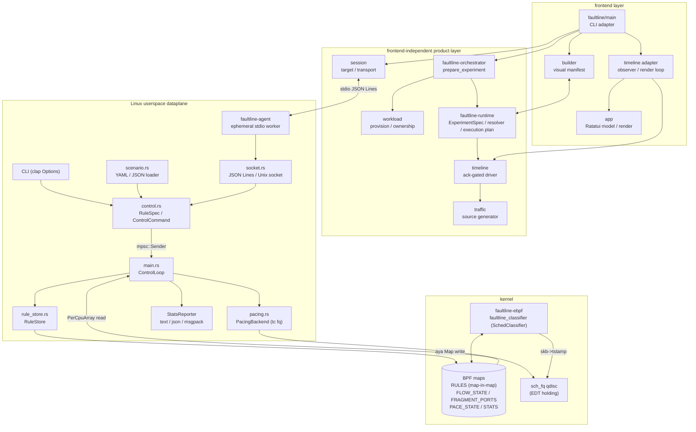
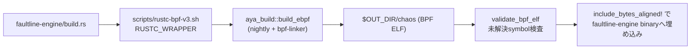
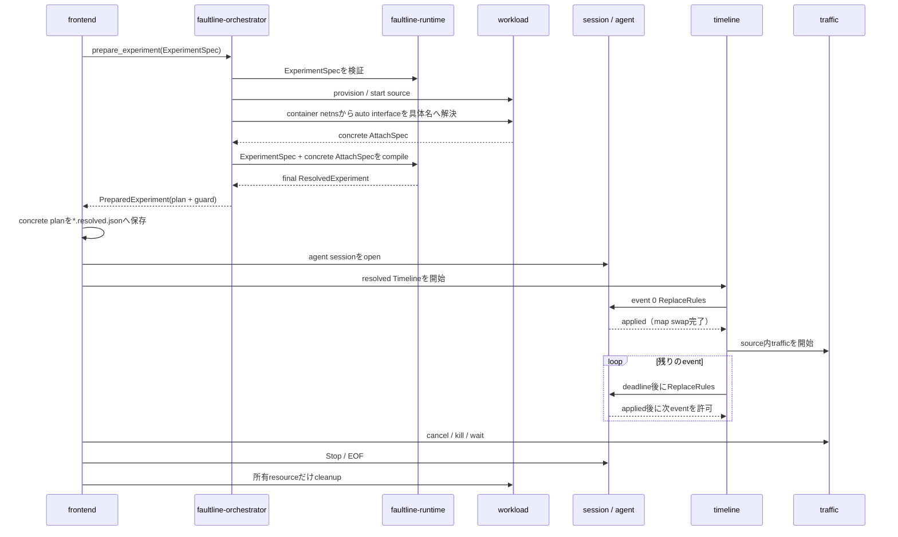
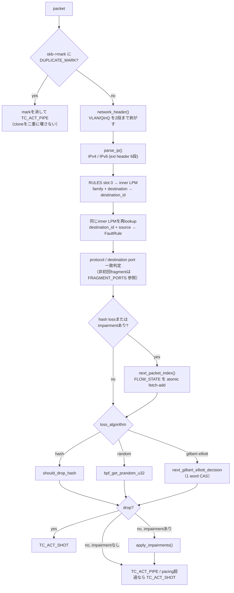

# Architecture

本workspaceは、アプリケーションエンジニアがUI、manifest、またはlibrary APIから再現可能な
ネットワーク障害実験を扱うためのツールです。Aya/TC eBPFはLinux dataplane、`faultline-engine`はその
低レベルengine、`faultline`は現在の主frontendです。本書はcrate構成、experiment runtime、
control plane、data plane、およびその境界を記述します。プロダクト定義は[PRODUCT](PRODUCT.md)、
利用方法は[README](README.md)を参照してください。

## 全体像



## Crate構成

Cargo workspaceは9 crateです。`default-members`はLinux専用workerと`faultline-ebpf`を除外し、通常の
`cargo check` / `cargo test`がhost targetだけを対象にします。

| crate | target | 役割 |
| --- | --- | --- |
| `faultline-common` | `no_std`（両側で共有） | `#[repr(C)]`のmap ABI型と、決定論的な判定ロジック |
| `faultline-protocol` | portable | `RuleSpec`、request/response、JSON Lines codec |
| `faultline-runtime` | portable | experiment/workload/L3 destination model、validation、concrete planへのcompile |
| `faultline-orchestrator` | host adapter | workload lifecycle、interface/target解決、agent session、timeline driver、traffic所有 |
| `faultline-ebpf` | `bpfel/bpfeb-unknown-none` | TC classifier本体。packet parse、rule lookup、impairment適用 |
| `faultline-engine` | host | CLI、scenario読み込み、load/attach、map反映、統計出力 |
| `faultline-agent` | Linux | stdio sessionとlocal engineのlifecycleを所有する一時worker |
| `faultline` | portable frontend | ratatui builder、観測state、描画、CLI option adapter |
| `faultline-lab` | host | LXC labで使うTCP client/server/transfer harness |

`faultline-common`だけがeBPFとuserspaceの双方から依存されます。`user` featureで
`aya::Pod`実装を追加するため、userspaceは同じ構造体をそのままmapへ書き込めます。
判定関数（`should_drop_hash`、`gilbert_elliott_step`、`seeded_delay_ns`、
`serialization_delay_ns`、`edt_base_ns`）はこのcrateに置かれ、権限なしのunit testで
確率境界と再現性を検証できるようにしています。

### 実装上の境界

- eBPF側はverifier、stack深度、instruction数、生成コードを優先します。boundedな明示的loopや
  `inline`は、それらを予測可能にする場合に維持します。
- userspace側の入力は共有中間表現へcompileし、検証と変換を型ごとの小さな関数へ置きます。
  順序検証のように直前値を渡す処理は`try_fold`、独立した検証列は`try_for_each`で表現します。
- iterator化自体は目的にしません。I/O、process lifecycle、TUI event loop、BPF mapの構築・公開など、
  副作用の順序が意味を持つ処理は明示的loopのままにします。
- userspaceのstream転送とdrainは`io::copy`、固定長protocol tokenは`read_exact`、JSON Linesは
  line codec/helperで表現します。手動chunk、remaining counter、改行の分割writeを
  application logicへ露出させません。明示的なbyte offsetとraw representationは、意図的に
  malformed packetを作るdataplane test、wire/LPM key layout、Aya/kernel ABI境界に限定します。

### ビルドパイプライン



- rustc wrapperはtargetが`bpf*-unknown-none`のときだけ`-Ctarget-cpu=v3`を付けます。
  return-value付きatomic fetchがISA v3を要求するためで、userspace側のbuildには影響しません。
  既存の`RUSTC_WRAPPER`（`sccache`等）は`FAULTLINE_RUSTC_WRAPPER_NEXT`へ退避してchainします。
- `validate_bpf_elf`は未解決symbolを検出してbuildを失敗させます。`__multi3`のような
  compiler-rt helperはAyaが再配置できず、loadしてから初めて壊れるためです。
- `faultline-ebpf/build.rs`は`bpf-linker`の存在確認だけを行います。
- `mise run build-agent-image`は`packaging/agent.Dockerfile`で、`faultline-engine`、`faultline-agent`、
  E2E用`faultline-lab`のrelease binaryを`debian:trixie-slim`へ置いたimageを作ります。TUIのDocker adapterが
  `--network container:<name>`で起動するのはこのimageです。

## 実験実行境界

`faultline-runtime`は、プロダクトUXと低レベルdataplane protocolの間にあるportableかつ
非特権の境界です。`ExperimentSpec`、Local/Docker/LXCのsource workload、L3 destination、
fault profile、traffic generatorを所有します。container interfaceの`auto`はauthoring用の
`WorkloadSpec`だけが保持し、runtime adapterが具体化した`AttachSpec`を注入してから実行planへ
compileします。

- concrete attach target（runtime、container、具体的なinterface）
- snapshot解決済みのIPv4/IPv6 network列
- protocolと任意のdestination port
- atomicな`RuleSpec`列からなる`Timeline`
- source内で動かす任意のtraffic定義

`faultline-engine`と`faultline-agent`はWorkload、DNS、experiment manifestを知りません。agentへ渡るのは
interface、direction、具体化済みL3 ruleだけです。

`ResolvedExperiment`は、authoring入力を実行可能なL3 rule、concrete attach、timelineへcompile済みの
最終形だけを表します。`auto`を含む中間状態は存在せず、後からattachを書き換えるAPIも持ちません。
実行境界における状態は次の通りです。

| phase | destination | attach interface | 外部作用 |
| --- | --- | --- | --- |
| manifest | hostname/IP/CIDR | explicitまたは`auto` | なし |
| workload prepare | hostname/IP/CIDR | `WorkloadSpec`上のselector | provision/start |
| adapter resolve | hostname/IP/CIDR | concrete `AttachSpec`を生成 | container netnsを検査 |
| final compile | snapshot済みnetwork列 | 必ず具体名 | DNS解決 |
| agent/timeline | 具体化済みL3 rule | 必ず具体名 | attach、map更新、traffic |

### Source workload

| runtime | discovery | lifecycle / provision | agent attach |
| --- | --- | --- | --- |
| Local | host interface | 任意の引数vector processを起動し、所有childだけkill/wait | host上でagentをspawn |
| Docker | running/stopped container | existing/session、imageからcreate、所有containerだけstop/remove | targetのnetnsを共有するsidecar |
| LXC | running/stopped container | existing/session、download templateからcreate、所有containerだけstop/destroy | `lxc-attach`でtarget内にspawn |

新規LXCには現在のagentとengineをrootfsへ配置してから起動します。provision、tooling配置、startの
途中で失敗した場合は、その実験が作成したcontainerをrollbackします。既存のprocess/containerを
cleanup対象に昇格させることはありません。

Docker/LXCの`interface`は省略時に`auto`です。provision/start後にcontainer netnsのloopback以外を
列挙し、候補が1つなら採用します。0件または複数件なら候補を示して停止し、複数NIC環境で暗黙の
誤attachをしません。明示名はそのまま使います。解決結果からconcrete `AttachSpec`を生成し、それを
`ExperimentSpec::compile`へ注入します。agent起動と`*.resolved.json`の生成はfinal compile後に行うため、
`AttachSpec`、`ResolvedExperiment`、低レベル境界のいずれにも`auto`は残りません。

直接指定するtarget URIは`docker://NAME`、`lxc://NAME`を`auto`の省略形として受け付けます。
`docker://NAME/eth1`のような明示形はdiscoveryを迂回します。Localはnetwork namespaceを起動する
adapterではないため`local://INTERFACE`を必須とし、`local://auto`は受け付けません。

### L3 destinationとsnapshot解決

destinationはmanaged workloadではなく、IP address、CIDR、またはhostnameとして表現します。
hostnameやdiscovery結果は入力支援であり、実行時にはIPv4/IPv6 host routeへ一度だけ解決します。
final compileで得たL3解決結果をそのまま実行へ渡すため、agent実行までDNSを再解決しません。
実際に使ったnetwork、具体化後のattach先、targetを書き換えたtimelineは`*.resolved.json`へ保存されます。

### Visual builderとmanifest

引数なしの`faultline`はvisual builderを開きます。内部schemaは独自UI型ではなく
`ExperimentSpec`そのものです。

- F2でbrief outage、lossy link、slow link templateを選ぶ
- Local/Docker/LXCとdiscovery済み候補を選択する
- L3 destination、protocol/port、fault window、任意のHTTP trafficを編集する
- Ctrl-Sでmanifestを保存し、Ctrl-Eでpreflight後に保存・実行する
- `--edit-experiment`で既存manifestを読み込む

round-tripではextension、command traffic、Docker/LXC provision詳細、画面外のfault fieldを
保持します。現在のvisual timelineが表現できないevent形状は、黙って簡略化せず編集開始時に
rejectします。

### Trafficと実行状態

HTTPまたはshellを介さない任意のargument-vector commandをsource workload内で周期実行できます。
agentの初期attachに続き、event 0のsnapshot ruleset全体が`applied`になってからtrafficを開始するため、
最初のbaseline requestから全destinationのstatsへ現れます。実行中のTUIは
`Provision → Connect → Impair → Observe`を表示し、eBPF statsとtrafficの成功・失敗数を同時に
描画します。終了時はin-flight commandをkill/waitしてからworkloadをcleanupします。

### Orchestratorとfrontendの境界

`faultline-orchestrator`はfrontendを持たないlibrary crateです。TUI、将来のCLI、test harnessは
`prepare_experiment`を呼ぶだけで、validate → provision/start → interface具体化 → final compileの
順序とresource ownershipを共有できます。`PreparedExperiment`はconcrete planと`WorkloadGuard`を
一体で保持するため、frontendが実行中にworkloadを早期cleanupすることもありません。

| `faultline-orchestrator` module | 責務 |
| --- | --- |
| `experiment` | frontend非依存のprepare順序、concrete planとworkload ownershipの束縛 |
| `workload` | Local process、Docker、LXCのprovision、ownership、rollback、interface具体化、cleanup |
| `session` | target discovery、concrete target検証、local/LXC/Docker agent起動、stdio/Unix socket transport |
| `timeline` | profile/replay読込、event scheduling、ack gate、event 0後のtraffic開始、blocking playback、control操作 |
| `traffic` | source workload内のshell-free traffic commandとcancel/reap |

`faultline`に残るのは`builder`、`app`、`main`とobserved timeline adapterです。adapterは
`ExperimentDriver`が返すactionをagentへ送り、messageをAppへ反映してRatatuiを描画します。時刻順序、
ack待ち、event 0後のtraffic開始をTUI自身では決定しないため、非対話CLIも同じdriverを利用できます。

observed experimentではevent 0の完全なsnapshot rulesetが`applied`になった後でtrafficを開始します。
各eventも直前のack後にだけ送るため、複数のIPv4/IPv6 destinationを持つ場合も最初のrequestから
観測対象となり、遅いmap更新でtimeline commandが追い越しません。



## Control plane

入力形式とBPF map操作を分離する層です。CLI引数もscenario fileも、まず共通の
`RuleInput`へ変換されます。percentageやfield間制約の検証、quantize、`RuleSpec`への
compileを一箇所で行い、transport非依存の`ControlCommand`として実行loopへ渡します。

```mermaid
sequenceDiagram
    participant Src as 入力source (CLI / scenario / Unix socket)
    participant Ch as ControlChannel (mpsc, cap 16)
    participant Loop as ControlLoop
    participant Store as RuleStore
    participant Map as BPF maps

    Src->>Ch: ReplaceRules(Vec<RuleSpec>)
    Ch->>Loop: recv()
    Loop->>Store: apply(command)
    Store->>Store: validate / group by destination
    Store->>Map: LpmTrie + Array へ書き込み
    Note over Loop: attach後もchannelを監視し続けるため<br/>rule更新でre-attachは不要
    Ch-->>Loop: Stop（--duration timer / outage復帰後）
```

- `RuleSpec::validate`がid範囲、address familyの一致、確率の上限、GE parameterの
  必須条件、port指定時のprotocolを検査します。CLIとscenarioで同じ検証を通ります。
- `ControlChannel::schedule`は**attach後**にtimerを開始します。scenarioの時間が
  「実際に障害が適用され得る時点」から計測されるようにするためです。
- outage windowは`ControlCommand::ReplaceRules`で100% lossのruleへ差し替え、
  期間後に元のruleへ戻す実装です。stateful GEのruleでも通常のhash pathへ強制します。
- `ControlChannel::sender()`はUnix socket adapterと将来のfile watcher向けに公開しています。
- `fq`の要否は起動時に確定します。初期ruleがEDTを要求する場合に加え、
  `--control-socket`かつ`--direction egress`のときは無条件にinstallします。
  あとから投入されたdelay/bandwidth ruleが「qdiscが無いので静かに効かない」状態を
  避けるためです。逆にingressでは`validate_rules_for_direction`が実行loop側でも
  EDT系・duplicate ruleをrejectし、そのconnectionへerrorを返します。

### Transportとephemeral agent

`--control-socket PATH`はmode 0600のUnix socketを作り、newline区切りJSONを双方向に流します。
connection taskはrequest ID付き`ControlEnvelope`をcontrol loopへ送り、oneshot responseを
待ちます。`replace_rules`の`applied`は`RuleStore::apply`がinner mapを構築し、outer mapを
swapした後に返るため、queue受理通知ではありません。validationやmap更新に失敗したrequestは
daemonを停止せず、そのconnectionへ`error`を返します。

`StatsReporter`はstdoutと同時にbroadcast channelへ同じJSON eventをpublishします。socketは
これをsubscribeし、responseとlive statsを同じstreamへ多重化します。遅いconsumerは古いstats
だけをskipし、control commandの適用を妨げません。

wire型は`faultline-protocol`にあり、Unix socketとstdioで同じJSON Linesを使います。
`faultline`はAyaやLinux APIへ依存しません。local/LXC/Docker adapterが`faultline-agent`をchildとして
起動し、stdin/stdoutをprotocol transportにします。agentはLinux側で`faultline-engine` engineとprivate
Unix socketを作り、stdio EOFを`Stop`へ変換します。これによりTUIの異常終了を含むsession終了が
TC detachとqdisc cleanupへ収束します。Dockerは対象containerのnetwork namespaceを共有する
一時container、LXCは`lxc-attach`を使い、どちらもlistener portやglobal registryを持ちません。
agentはengineを起動する前にeffective capabilityを検査し、`CAP_NET_ADMIN`と`CAP_BPF`（legacy
kernelでは`CAP_SYS_ADMIN`）が不足していれば、BPF loadの不透明な失敗になる前に診断を返します。

target URIがadapterを選びます。

| target URI | agentの起動方法 |
| --- | --- |
| `local://IFACE` | `faultline-agent`をそのままchild processとしてspawn |
| `lxc://NAME/IFACE` | `lxc-attach -n NAME -- faultline-agent` |
| `docker://NAME/IFACE` | `docker run --rm -i --network container:NAME --cap-add NET_ADMIN --cap-add BPF <agent image>` |
| `auto://NAME/IFACE` | DockerとLXCの実行中containerを探索し、一意に決まればそのURIへ解決 |

引数なしではvisual experiment builderを開きます。低レベルURIを明示した場合は起動前に
containerの実在を検証し、`--list-targets`では候補だけを列挙します。
`--socket PATH`を渡した場合はagentを起動せず、既存のcontrol socketへ直接接続します。

### RuleStore

`ControlCommand`をAya Mapへ反映する唯一の場所です。

1. destination prefix（`IpNet::trunc()`）でruleをgroup化します。
2. 新しいinner LPMへ、family＋destination prefixから`destination_id`を引くentryと、
   source namespace＋`destination_id`＋source prefixから`FaultRule`を引くentryを登録します。
3. generationを進め、`(rule_id, generation)`ごとの`PACE_STATE`を0初期化します。
   旧generationを処理中のpacketは以前のclockを使い続けます。
4. outer `RULES`のslot 0を新しいinner LPMへ差し替えます。この1回がgenerationの公開点です。
5. rule idの重複と、同一destination内でのsource prefix重複をrejectします。

inner LPMは公開前に完成しているため、packetは旧generationか新generationのどちらかを参照し、
rule未設定や部分更新の状態を参照しません。`ControlCommand`のAPIは従来どおりです。

### 起動シーケンス

`main`の順序には意味があります。

1. `Ebpf::load`（program本体は未load）
2. rule sourceの解決 → `ControlChannel::for_rules`
3. **`RuleStore::apply`で初期ruleを書き込む**
4. `attach`（`SchedClassifier`のload + attach）
5. `PacingBackend::install`（初期ruleがEDTを使う、または control socket + egress のとき）
6. timerのschedule → statsのreport loop

先にmapを埋めてからattachするため、attach直後の最初のpacketから正しいruleが
適用され、rule未設定の窓が生じません。

## Data plane（faultline-ebpf）

`faultline_classifier`はTC classifierで、ingress/egressのどちらにもattachできます。



### BPF map

| map | 型 | 役割 |
| --- | --- | --- |
| `RULES` | `ArrayOfMaps<LpmTrie<_, RuleNode>>` | slot 0がactive generation。destination lookupとsource lookupを名前空間分離した同一inner LPMで行う |
| `FLOW_STATE` | `LruHashMap` (65,536) | flow×rule×generation単位のpacket sequenceとGE state |
| `FRAGMENT_PORTS` | `LruHashMap` (32,768) | 初回fragmentのportを30秒だけ後続fragmentへ引き継ぐ |
| `PACE_STATE` | `LruHashMap<PaceKey, PaceState>` | rule×generationごとのaggregate bandwidth clock。旧generationはLRU eviction |
| `STATS` | `PerCpuArray<RuleStats>` | ruleごとのcounter。userspaceが全CPUを合算 |
| `DIAGNOSTICS` | `PerCpuArray<DiagnosticStats>` (1 entry) | rule決定前のparser・CIDR・protocol・port missとclone bypass |

inner LPMを二度lookupするのは、同じdestinationに対してsource別のpolicyを持たせながら、
destination/sourceの両entryを1つのgenerationとしてatomicに公開するためです。二つの
namespaceはkey先頭byteで分離され、source側は`destination_id`を含むため別destinationの
source prefixとは衝突しません。sourceの最長prefix選択はLPM自身が行います。

### Profileとreplay timeline

`faultline-protocol::Timeline`はprofileとreplayに共通のportable schemaです。version、kind、
任意のtarget、全体durationと、`at_ms + 完全なRuleSpec列`のeventを持ちます。playerは各eventの
deadlineまで待って`ReplaceRules`を送り、`Applied`を受け取るまで次へ進みません。したがって
timelineの時刻は送信時刻ではなく、atomic map swapが完了した境界として観測できます。

TUI recorderは要求送信時ではなく`state`/`applied`応答時にrulesetを採取し、同一stateを
deduplicateします。statsや失敗した要求を保存しないため、生成されたreplayはそのままheadless
playerへ入力できます。schedulerはuserspace側にだけ存在し、BPF programへtimerやprofile状態を
持ち込みません。

### 決定論と並行性

- 判定入力は5-tuple、flow内packet sequence、rule ID、seedです。`seeded_value`が
  用途ごとに異なるdomain定数を混ぜるため、loss・jitter・reorder・duplicateの選択が
  互いに相関しません。
- `FLOW_STATE`はper-CPUではなく共有mapです。flowがCPU間を移動してもsequenceが
  連続するようにするためです。`packet_index`はbounded CAS loopで更新し、成功した
  exchangeの旧値で採番します。BPF targetでは`atomic_xadd` intrinsicの戻り値がfetch済み
  旧値にならないtoolchainがあるため、xaddの戻り値だけには依存しません。
- `packet_index`はhash loss、または決定論的なimpairment選択に必要な場合だけ進めます。
  純粋なrandom ruleはstateを作らず、純粋なGE ruleは次項の`ge_state`だけを更新します。
- Gilbert-Elliott stateは1 wordへ`bad bit | 秒単位timestamp(31bit) | sequence(31bit)`を
  packし、bounded CAS loop（4回）で更新します。3値を1回のCASで整合させるためです。
- `STATS`はper-CPUなので非atomic更新で足ります。
- LRU evictionは決定論的sequenceをそのflowについてやり直させるだけで、
  mapの無制限な成長を防ぎます。

### Data planeのPBT

`mise run lab:pbt`は生成したGSO skb列を`BPF_PROG_TEST_RUN`へ投入し、kernelのdrop列を
userspace参照モデルと比較します。skb、logical segment、wire byteの三つのloss率を別々に
集計します。固定回帰テストとは別に、以下の性質を実kernelで検査します。

- GSO segment数・size・wire長を変えてもskb単位のhash decisionが参照モデルと一致する
- inner mapのgeneration swap後は同じflow/Rule IDでもpacket sequenceが0から再開する
- 同一destinationに17件以上のsource Ruleを登録でき、LPMで該当Ruleを選択できる
- Gilbert-Elliottの生成系列がuserspace state machineと一致する
- IPv4 total length、IPv6 payload length、extension chain、VLAN、port/CIDR境界で
  paddingや宣言payload外をtransport headerとして誤認しない

### EDTによるqueue障害

delay、jitter、reorder、bandwidthは**netemに依存しません**。eBPFが
`skb->tstamp`へEarliest Departure Timeを書き、`sch_fq`がその時刻までpacketを保持します。

- `edt_base_ns`が既存のEDT（socket/TCP pacingが設定したもの）を後退させません。
  chaos delayはそのdeadlineより後ろに合成します。
- bandwidthは`PACE_STATE`のvirtual clockをbounded CAS loop（16回）で予約します。
  全attemptが競合に負けた場合はburstを出さないよう明示的にdropし、
  `pacing_dropped`として計上します。
- duplicateは`bpf_clone_redirect`で生成し、cloneにも独立したbandwidth slotを予約します。
  cloneはTCを再通過するため、`skb->mark`の`DUPLICATE_MARK`（bit 31）で識別して
  二重の障害適用を避けます。
- `delayed`は`delivery > base`のときだけ計上し、applicationやTCP stack由来の
  timestampをchaos ruleの成果として数えません。
- `PacingBackend`が入れる`fq`はhandle `7fff:`、horizon 24時間、`horizon_cap`、
  total limit 100,000、per-flow limitはu32最大値です。既存root qdiscがある場合は
  上書きせずerrorにし、`PacingGuard`のDropで自分が追加したqdiscだけを削除します。

EDTを使うoptionは`--direction egress`専用です。burst lossとoutageはqdiscを
必要としないため、ingressでも使用できます。

## 統計と出力

`STATS`をrule idごとに読み、全CPU slotを合算した累計を`StatsReporter`が
前回値との差分（`*_delta`）とともに整形します。出力は`text` / `json`（JSON Lines） /
`msgpack`（4 byte big-endian長 + MessagePack map）から選べます。

障害の選択と`packet_index`はskb単位です。statsはskbに加えて、`gso_segs`から推定した
logical segment数と`wire_len`から得たbyte数も集計します。GSO skbへのdrop actionはskb全体へ
作用するため、segment/byte drop counterもそのskb全体を計上します。これはsegmentごとの独立した
判定ではありません。`loss_percent`は従来どおりskb率で、新しいsegment/byte率も併記します。

`ControlLoop::run`は`tokio::select!`で3つのeventを待ちます。

- shutdown signal（Ctrl-C / SIGTERM）: 最終reportを出して終了
- stats interval tick: reportを出力
- control command: `RuleStore::apply`、`Stop`または channel closeで終了

終了すると`Ebpf`のdropでAyaがTC linkをdetachし、`PacingGuard`のdropでfq qdiscを外します。

## テスト階層

| 層 | 実行方法 | 対象 |
| --- | --- | --- |
| unit（`faultline-common`） | `mise run test` | 確率境界、seed再現性、GEのburst性、EDT合成、serialization time |
| unit（`faultline-engine`） | `mise run test` | CLI validation、scenario decode、pacing引数、control channelの順序 |
| unit（`faultline-runtime`） | `mise run test` | manifest validation、L3 snapshot解決、実行plan、workload/traffic command構築 |
| unit（`faultline-agent`） | `mise run test` | Linuxのeffective capability mask解析と不正な`CapEff`の診断 |
| unit（`faultline`） | `mise run test` | visual builder、manifest round-trip、template、Ratatui snapshot、adapter状態遷移、timelineのack直列化 |
| unit（`faultline-lab`） | `mise run lab:unit` | loopback TCPのrequest/response、download、upload。restricted sandboxではmise-agent経由で実行 |
| socket unit | `mise run lab:unit-sockets` | `faultline-lab`のloopback TCPと`faultline-engine`のUnix socket protocolをmise-agent経由で検証 |
| userspace workspace | `mise run lab:unit-workspace` | `faultline-ebpf`を除く全crateをsocket制限のないmise-agent経由で一括検証 |
| kernel integration | `mise run test-root` | `BPF_PROG_TEST_RUN`へ合成packetを渡し、IPv4/IPv6/VLAN/fragmentのmatchを検証 |
| LXC live control | `mise run lab:control` | faultline→Unix socket→map swap→実trafficとstats pushの往復を検証 |
| ephemeral local agent | `mise run lab:agent` | TUI所有stdio session中だけ障害が有効で、終了後detachすることを検証 |
| in-container LXC agent | `mise run lab:agent-lxc` | LXC netns内agentの適用とstdio EOF cleanupを検証 |
| profile timeline | `mise run lab:profile` | timed atomic rulesetがpass→outage→recoveryし、終了後detachすることを検証 |
| rendered TUI E2E | `mise run lab:tui` | 実LXC traffic→agent stats→App→140列TestBackend描画の全経路、target/direction表示、detachを検証 |
| experiment E2E | `mise run lab:experiment` | manifest→LXC provision→L3解決→traffic→fault timeline→stats→cleanupとresolved sidecarを検証 |
| Docker agent E2E | `mise run lab:agent-docker` | 対象containerのnetnsを共有するsidecar agentの適用、stats、終了時cleanupを検証 |
| LXC lab | `mise run lab:test` | 実trafficでbaseline、hash/random loss、複数rule scenario、各impairment、burst、outageを検証 |
| dataplane PBT | `mise run lab:pbt` / `lab:pbt-long` | 生成GSO skb列を`BPF_PROG_TEST_RUN`へ投入し参照モデルと突き合わせ |
| offload比較 | `mise run lab:offload` | GSO/TSO/GRO のon/offで実uploadのskb・segment・byte lossを比較 |
| 手動負荷 | `mise run lab:traffic` | TUI操作中に client→server のtrafficを流し続ける |

kernel integration testはinterfaceへattachしないため実通信を変更しません。buildは
通常ユーザーで行い、生成されたtest binaryだけを`sudo`で実行します。

labは`faultline-client`（10.203.0.2）と`faultline-server`（10.203.0.3:8080）の
2 containerで、client側host interfaceへTC programをattachします。`faultline-lab`が
TCP client/server/transferを提供し、成功率・所要時間・分散のassertionを行います。

### 実行環境まわりの補助

- `scripts/lab/sudo.sh`がlab taskのroot実行を一元化します。mise taskがstdinを握るため、
  制御端末（`/dev/tty`）を実際にopenして認証し、以降は非interactiveな`sudo -n`だけを使い、
  timestampを別processで維持します。端末が無い場合は`SUDO_ASKPASS`へfallbackします。
- `scripts/mise-agent.py`はmise taskをUnix domain socket越しに実行する開発用agentです。
  socket permission、`SO_PEERCRED`によるuid検証、task許可listで制限し、追加引数と環境変数は
  既定で拒否します。root常駐させると`sudo`を要するlab taskを端末なしで駆動できます。
- `mise run lab:install`はlab前提のDebian package（`lxc`、`iproute2`、`ethtool`、
  `tcpdump`など）を入れます。`lab:offload`は`ethtool`と`nsenter`、`tcpdump`に依存します。

## 既知の構造上の制限

- scenario fileのwatch/reloadは未実装です。live rule更新はUnix control socketで行えます。
- 複数ruleの差し替えはmap-in-mapのinner LPM交換によりgeneration単位でatomicです。
- inline VLANは2段（QinQ）、IPv6 extension headerは6段まで。
- fragmentは初回fragmentが先に到着した場合のみportでmatchできます。
- EDT pacingはinterfaceのroot qdiscとして`sch_fq`を一時的に占有します。(メインの想定はDocker,LXCなので許容している。)
